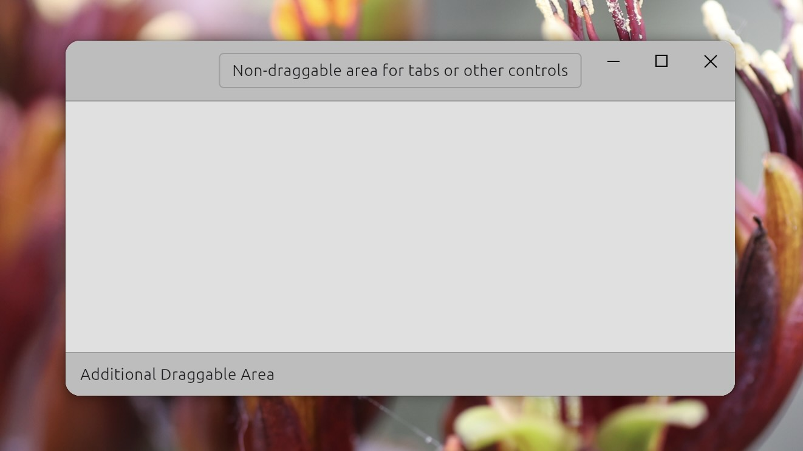
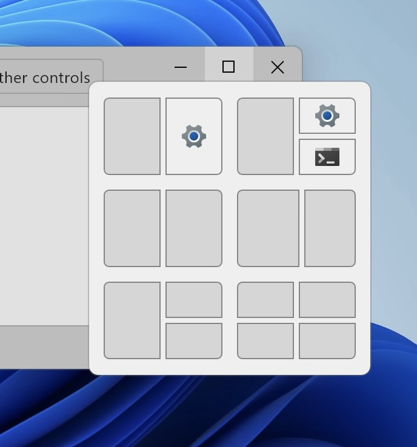

# window_toolbox

`window_toolbox` is a Flutter package for building custom window chrome compatible with Flutter's multi-window API. Special care has been taken to ensure that expected platform behavior, such [snap layout](https://support.microsoft.com/en-us/windows/snap-your-windows-885a9b1e-a983-a3b1-16cd-c531795e6241) on Windows, is preserved, while still allowing for a high degree of customization.

In addition to custom window chrome, this package also provides extension classes on top of native window controllers, exposing more native window functionality and allowing to react to subset of `NSWindowDelegate` methods or handing `win32` messages directly in Dart.



## Custom window chrome

To customize window, it is necessary first to start with disabling existing window decorations:

```dart
controller = RegularWindowController(...);
controller.enableCustomWindow();
```

Once that is done, you can place various widgets in your widget tree to build draggable areas, traffic light buttons (macOS) or window buttons:

- `WindowDragArea` - Widget that creates area that can be used to drag the window.
- `WindowDragExcludeArea` - Marks places inside `WindowDragArea` that should not be draggable. This is useful for buttons in title bar, tabs, or other controls that should not participate in window dragging.
- `WindowTrafficLight` - a "proxy" widget for macOS traffic light. Wherever this widget is placed, the actual macOS traffic light buttons will be positioned. This widget can also be used to hide the traffic light buttons completely.
- `MaximizeButton`, `MinimizeButton`, `CloseButton` - Widgets representing standard window buttons. These accept custom builders so the presentation is fully customizable, while ensuring the proper behavior on each platform. On Windows the `MaximizeButton` properly supports the [snap layout](https://support.microsoft.com/en-us/windows/snap-your-windows-885a9b1e-a983-a3b1-16cd-c531795e6241) popup.
- `WindowBorder` - On Linux draws shadows, border and clips the content to round corners (if specified). On other platforms this widget has no effect, since shadows, borders and clipping are handled by the system compositor.

A [complete example](example/lib/main.dart) of fully customized window can be found in the [example](example) directory.



## Additional window functionality

On top of custom window chrome, `window_toolbox` also provides some additional platform specific functionality related to native windows.

This includes:

- Exposing more of `NSWindow` API and ability to register custom delegate for macOS windows. See [WindowDelegateMacOS](lib/src/macos_extra.dart) for more details.

- Ability to register custom delegate and message handlers on Windows. See [Win32MessageHandler](lib/src/win32_extra.dart) for more details.

- Ability to register custom delegate on linux. See [WindowDelegateLinux](lib/src/linux_extra.dart) for more details.

#### Example: Setting [NSWindowCollectionBehavior](https://developer.apple.com/documentation/appkit/nswindow/collectionbehavior-swift.struct) on macOS

```dart
final controller = RegularWindowController(...);
if (controller is WindowControllerMacOS) {
  final controllerMacOS = controller as WindowControllerMacOS;
  // Add fullScreenNone to existing collection behavior to disable
  // full screen mode for this window.
  controllerMacOS.collectionBehavior = {
    ...controllerMacOS.collectionBehavior,
    NSWindowCollectionBehavior.fullScreenNone,
  };
}
```

The  windowing API surface is very big and exposing more of the platform specific functionality is planned, requests and contributions are welcome.